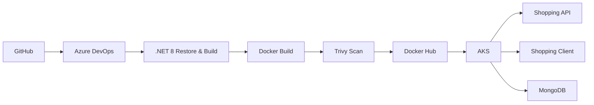
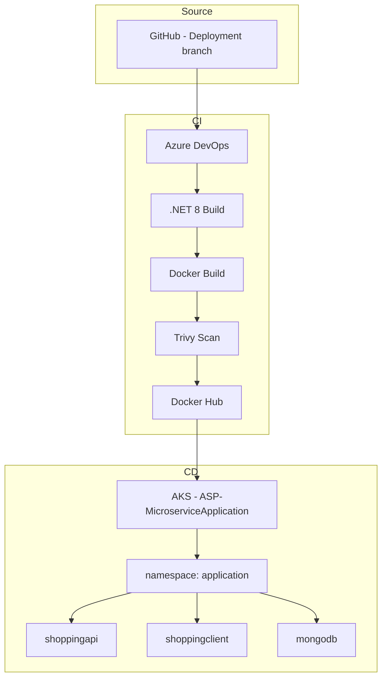

# Deploying .Net Microservices to Azure Kubernetes Services(AKS) and Automating with Azure DevOps

> A small but deliberate exploration of building a reliable CI/CD path for .NET microservices — with cost awareness, security scanning, and clear trade-offs.

This repository started as a learning exercise based on the excellent [aspnetrun/run-devops](https://github.com/aspnetrun/run-devops) project.  
I kept the original application structure and overall picture, then rebuilt the delivery path around real constraints I hit while running it on a personal Azure subscription.

| Image | Status |
| ------------- | ------------- |
| Shopping Client | [](https://dev.azure.com/hardikaroracs22//_build/latest?definitionId=14&branchName=main) |
| Shopping API | [](https://dev.azure.com/ezozkme/shopping/_build/latest?definitionId=13&branchName=main) | | |

---

## What this project actually does




Two independent pipelines:

| Service          | Image                          | Trigger Path                  |
|------------------|--------------------------------|-------------------------------|
| Shopping API     | `hardik0811/shoppingapi`       | `Shopping/Shopping.API/**`    |
| Shopping Client  | `hardik0811/shoppingclient`    | `Shopping/Shopping.Client/**` |

Both follow the same pattern:

1. Restore & build (.NET 8)
2. Docker build (correct context)
3. Trivy scan (currently soft-fail)
4. Push to Docker Hub
5. Deploy to AKS (only on `main`, with environment approval)

---

## Why I changed things from the original

The original project used Azure Container Registry and a fuller AKS deployment path.  
That works well for enterprise demos. On a personal / student subscription it quickly became expensive and noisy.

### Cost decision

I moved the container registry from ACR to Docker Hub.

| Before              | After                |
|---------------------|----------------------|
| ACR (paid)          | Docker Hub (free tier) |
| Recurring registry cost | Near-zero registry cost |

This was not “ACR is bad”.  
It was a conscious trade-off: for this scale, the operational and financial overhead of a private registry was not justified.

I wrote about the migration and the cost impact here:  
→ [Right-sizing my microservice Kubernetes setup](https://hardik0811arora.hashnode.dev/right-sizing-my-microservice-based-kubernetes-deployment-escaping-acr-costs-and-fixing-oomkilled-pods)

### Resource sizing lesson

On a small node pool I hit a classic trap:

- MongoDB was OOMKilled because of an overly tight memory limit
- The API started returning 500s because it could not reach the database

The fix was not “give everything more resources”.  
It was to size requests and limits according to the actual workload instead of copying generic production values.

---

## Key technical decisions (and why)

### 1. Docker build context

The Dockerfiles expect the context to be the `Shopping/` folder:

```dockerfile
COPY ["Shopping.API/Shopping.API.csproj", "Shopping.API/"]
```

Running the build from the repository root fails.  
The pipeline therefore sets:

```yaml
buildContext: '$(Build.SourcesDirectory)/Shopping'
```

This is a small detail that caused several hours of debugging.  
I wrote about it in the longer journey post below.

### 2. Image identity must be consistent

One of the more embarrassing (and useful) bugs:

- Build produced `shoppingapi:31`
- Push tried to push `shoppingclient:31`

The rule that came out of it:

> Build, scan, and push must agree on the exact identity of the artifact.

Both pipelines now construct the image name the same way:

```text
$(dockerHubUsername)/$(imageRepository):$(Build.BuildId)
```

### 3. Soft security gate (for now)

Trivy is intentionally configured with `--exit-code 0` while I am still validating the full path to the registry and AKS.

The long-term intent is a hard gate on HIGH/CRITICAL.  
Right now the priority is proving the artifact can travel through the entire system.

### 4. Separate pipelines + reusable templates

Each service has its own pipeline.  
Common steps live in templates:

- `templates/ci/build-dotnet.yml`
- `templates/security/trivy-scan.yml`
- `templates/cd/deploy-infra.yml`
- `templates/cd/deploy-aks.yml`

Service-specific values (project path, Dockerfile, image name) stay in the pipeline.  
The template only knows *how* to build and deploy a service.

---

## Architecture (current)



- **CI** runs on `develop` and `main`
- **CD** runs only on `main` and requires approval on the `dev` environment
- AKS uses Azure RBAC + Entra ID
- Images are pulled from Docker Hub (imagePullSecrets in place)

---

## What I deliberately left out (for now)

| Item                    | Reason                                      |
|-------------------------|---------------------------------------------|
| Azure Container Registry| Cost for this scale                         |
| Full GitOps / ArgoCD    | Scope control                               |
| Policy / Governance     | Not the current learning goal               |
| Terraform for AKS       | Planned next — after the application path is stable |

I prefer to get one path working cleanly before adding the next layer.

---

## Writing & deeper notes

I documented the messy parts (the ones that actually taught me something):

- [My breaking and learning journey with Azure DevOps CI](https://hardik0811arora.hashnode.dev/my-breaking-and-learningjourney-with-azure-devops)  
  Docker context issues, image name mismatches, Trivy soft-fail strategy, and why I temporarily removed AKS.

- [Right-sizing the setup – ACR → Docker Hub + resource limits](https://hardik0811arora.hashnode.dev/right-sizing-my-microservice-based-kubernetes-deployment-escaping-acr-costs-and-fixing-oomkilled-pods)  
  Cost decision and the MongoDB OOMKilled incident.

---

## Credits

This project is built on top of the original work by **aspnetrun**:

- Original repository: [aspnetrun/run-devops](https://github.com/aspnetrun/run-devops)

I kept the overall picture and the Shopping API / Client structure, then reworked the delivery path, registry choice, pipeline structure, and operational decisions for a smaller, cost-conscious environment.

---

## Current status

| Layer              | Status                          |
|--------------------|---------------------------------|
| .NET 8 build       | Working                         |
| Docker build       | Working (correct context)       |
| Trivy scan         | Working (soft-fail)             |
| Push to Docker Hub | Working                         |
| AKS cluster        | Took it off for Now to save costs (Azure RBAC enabled)    |
| CD to AKS          | Running|
| Terraform for AKS  | Planned                        |

---

```
If you are a senior engineer reading this:  
I am still early in my career. What I care about is understanding the real trade-offs — cost, complexity, security gates, and operational reality.

I am happy to walk through any part of this pipeline, the failures I hit, or the decisions I made.
```

---
