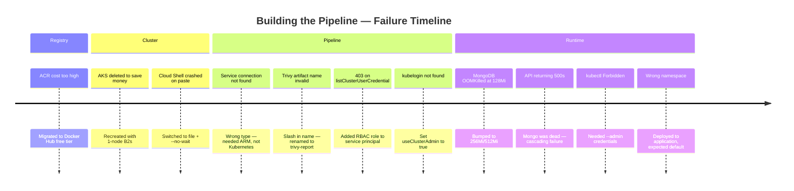

# .NET Microservices on AKS — CI/CD with Azure DevOps, Docker Hub & Trivy

> Building a reliable delivery path for containerized .NET microservices — with real cost constraints, actual failures, and the engineering trade-offs that came out of them.

This project started as a learning exercise built on top of the excellent [aspnetrun/run-devops](https://github.com/aspnetrun/run-devops) repository.  
I kept the original application structure (Shopping API + Shopping Client + MongoDB), then rebuilt the entire delivery and deployment path around constraints I actually hit while running this on an **Azure for Students** subscription.

The goal was never to build the most complex pipeline possible.  
It was to understand what happens between a `git push` and a running pod — and to make every piece of that path work for real.


The fix was not "give everything more resources."  
It was to size requests and limits based on what the workload actually needs:

| Component | Before | After | Why |
|---|---|---|---|
| MongoDB memory | `64Mi / 128Mi` | `256Mi / 512Mi` | `mongod` baseline is ~200Mi |
| MongoDB CPU | `250m / 500m` | `100m / 250m` | Mongo is memory-bound, not CPU-bound |
| Shopping API | `250m / 500m` | `50m / 250m` | Small .NET API, minimal CPU at rest |

### 7. AKS with Entra ID + Azure RBAC

The cluster uses Azure RBAC instead of Kubernetes-native RBAC:

```bash
az aks create \
  --enable-aad \
  --enable-azure-rbac \
  --node-vm-size Standard_B2s_v2 \
  --node-count 1
```

This means:
- Authentication goes through **Entra ID** (formerly Azure AD)
- Authorization is managed via **Azure role assignments**, not `ClusterRoleBindings`
- Pipeline uses `useClusterAdmin: true` to bypass `kubelogin` issues in CI

---

## The Failures That Taught Me the Most

This is the condensed version. The full "Caveman War Log" lives in my [Obsidian notes](https://github.com/felicitousbeing999-h/Obsidian01/tree/main/Azure-Devops-Microservice-App).



A few that stand out:

| Failure | What I Learned |
|---|---|
| **Trivy artifact name had a `/` in it** | `hardik0811/shoppingapi` is a valid image name but an invalid Azure DevOps artifact name. Renamed to `trivy-report`. |
| **Cloud Shell disconnected on long paste** | Write scripts to a file, run with `--no-wait`, poll status. Don't paste 40 lines into a web terminal. |
| **403 on AKS credentials** | With Azure RBAC enabled, the service principal needs an explicit role assignment on the cluster resource. It's not automatic. |
| **CD deployed to wrong namespace** | Variables said `application`, but the cluster was configured for `default`. A one-word mismatch that silently succeeded with zero running pods. |

---

## Repository Structure

```text
run-devops/
│
├── Shopping/                           # Application source code
│   ├── Shopping.API/                   # .NET 8 Web API + Dockerfile
│   └── Shopping.Client/                # .NET 8 MVC Client + Dockerfile
│
├── pipelines/                          # Azure DevOps pipeline definitions
│   ├── shoppingapi-pipeline.yaml       # CI/CD for Shopping API
│   ├── shoppingclient-pipeline.yaml    # CI/CD for Shopping Client
│   └── templates/
│       ├── ci/
│       │   └── build-dotnet.yml        # .NET build + Docker build template
│       ├── security/
│       │   └── trivy-scan.yml          # Trivy container scan template
│       ├── cd/
│       │   ├── deploy-infra.yml        # Shared infra (Mongo, ConfigMaps, HPA)
│       │   └── deploy-aks.yml          # Service deployment to AKS
│       └── common/
│           └── variables.yml           # All shared pipeline variables
│
├── k8s/                                # Kubernetes manifests (used by CD)
│   ├── mongo.yaml                      # MongoDB Deployment + Service
│   ├── mongo-secret.yaml               # MongoDB credentials
│   ├── mongo-configmap.yaml            # MongoDB connection string
│   ├── shoppingapi-configmap.yaml      # API configuration
│   ├── shoppingapi.yaml                # API Deployment + Service
│   └── shoppingclient.yaml             # Client Deployment + LoadBalancer
│
└── aks/                                # AKS-specific configurations
    ├── shoppingautoscale.yaml          # HPA for API + Client
    ├── mongo.yaml                      # AKS-tuned Mongo (right-sized)
    └── commands.txt                    # AKS setup reference commands
```

---

## Current Status

| Layer | Status | Notes |
|---|---|---|
| .NET 8 build | ✅ Working | Restore, build, correct SDK version |
| Docker build | ✅ Working | Correct build context (`Shopping/`) |
| Trivy scan | ✅ Working | Soft-fail, report published as artifact |
| Push to Docker Hub | ✅ Working | `hardik0811/shoppingapi` + `shoppingclient` |
| AKS cluster | ⏸️ Paused | Taken offline to manage costs — Azure RBAC + Entra ID configured |
| CD to AKS | ✅ Validated | Deploys successfully when cluster is running |
| HPA autoscaling | ✅ Configured | Scales on CPU utilization |
| Terraform for AKS | 🗓️ Planned | Next phase — infrastructure as code |

---

## What I Deliberately Left Out (For Now)

| Item | Reason |
|---|---|
| Azure Container Registry | Cost for this scale wasn't justified |
| Full GitOps (ArgoCD / Flux) | Scope control — get one path working first |
| Azure Policy / Governance | Not the current learning goal |
| Terraform for AKS | Planned next, after the application path is stable |
| Helm charts | Keeping manifests simple while learning the fundamentals |
| Multi-environment (staging/prod) | Single `dev` environment is sufficient for learning |

I prefer to get one path working cleanly before adding the next layer.

---

## DORA & Continuous Improvement

This project is named with [DORA](https://dora.dev/) in mind — not because I've implemented their full framework, but because the DORA community's way of thinking about software delivery resonates with how I want to learn.

The four key metrics they focus on:

| Metric | Where I See It in This Project |
|---|---|
| **Deployment Frequency** | Independent pipelines per service, automated trigger on push |
| **Lead Time for Changes** | Template reuse reduces time from commit to deployed artifact |
| **Change Failure Rate** | Trivy scanning catches vulnerabilities before they reach the cluster |
| **Time to Restore** | Environment approval gate, separate infra + app deployment |

I'm not measuring these formally yet. But the pipeline was designed with these ideas in the background — small, independent, automated, and observable.

The DORA community taught me that improving delivery isn't about adding more tools.  
It's about understanding where time and risk actually live in your system.

---

## Writing & Deeper Notes

I documented the messy parts — the ones that actually taught me something:

📝 **[My Breaking and Learning Journey with Azure DevOps CI](https://hardik0811arora.hashnode.dev/my-breaking-and-learningjourney-with-azure-devops)**  
Docker context issues, image name mismatches, Trivy soft-fail strategy, reusable templates, and why I temporarily removed Kubernetes.

📝 **[Right-Sizing the Setup — ACR → Docker Hub + OOMKilled Fix](https://hardik0811arora.hashnode.dev/right-sizing-my-microservice-based-kubernetes-deployment-escaping-acr-costs-and-fixing-oomkilled-pods)**  
The cost decision, MongoDB OOMKilled incident, and resource right-sizing on a constrained node pool.

📓 **[Obsidian Engineering Notes](https://github.com/felicitousbeing999-h/Obsidian01/tree/main/Azure-Devops-Microservice-App)**  
Raw debugging sessions, AKS deployment commands, incident post-mortem, and the full "Caveman War Log" of every failure and fix.

---

## Credits

This project is built on top of the original work by **aspnetrun**:

- Original repository: [aspnetrun/run-devops](https://github.com/aspnetrun/run-devops)

I kept the Shopping API / Client application structure and the overall architecture picture, then reworked the delivery path, registry choice, pipeline structure, deployment manifests, and operational decisions for a smaller, cost-conscious environment.

---

## A Note

```
I'm still early in my career, and I'm building in public because I believe 
the best way to learn is to show your work — including the failures.

What I care about is understanding the real trade-offs: 
cost, complexity, security gates, and operational reality.

If you're a senior engineer reading this - I would genuinely love your feedback.
If you're someone learning the same things - I hope this helps. 
Let's figure it out together.
```

**Connect:** [LinkedIn](https://www.linkedin.com/in/hardik0811arora/) · [Hashnode](https://hardik0811arora.hashnode.dev/) · [Twitter/X](https://x.com/HardikArora0811)

---
